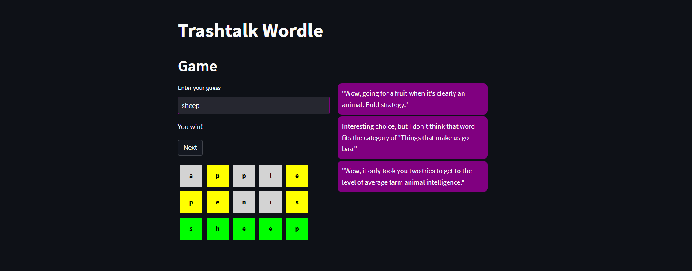

# Trashtal Wordle

Trashtalk Wordle is an engaging game where the player attempts to guess a secret 5-letter word. The unique twist is that after every guess, a sarcastic and cynical AI commentator makes a remark on the player's attempt. The player's aim is to uncover the secret word within six attempts, taking into account the AI's cheeky comments.



## How to Run

Make sure you have installed the required libraries mentioned in the `requirements.txt` file.

```bash
git clone https://github.com/JLoroy/trashtalk_wordle.git
cd trashtalk_wordle
streamlit run app.py
```

Make sure to set your OpenAI API key as an environment variable before running the app.

Open your browser and visit `http://localhost:8501` to see the app.

## How to Play

1. In the 'Enter your guess' field, enter your guess for the secret 5-letter word. It must be a 5-letter English word.

2. Submit your guess.

3. The feedback will be displayed next to your guess. The feedback consists of blocks. Each block represents a letter in your guess.

   - A lime-green block represents a letter that is correct and in the correct position.

   - A yellow block represents a letter that is correct but in the wrong position.

   - A light-gray block represents a letter that is not in the secret word.

4. A sarcastic comment from the AI will appear in the chat column on the right side.

5. Continue guessing based on the feedback until you guess the correct word or reach 6 attempts.

6. If you guess the secret word correctly, you win! If not, the game reveals the secret word.

7. To play again, click the "Play again?" button twice. This will start a new game with a new secret word.

### How it works

Built using LangChain and OpenAI.
The application uses Streamlit for a user-friendly and interactive interface. Users enter their idea into a text field and the AI responds with its critique in real-time. 

### Installation and Usage

This application is designed to be easy to use. Simply clone the repository from GitHub and run the Streamlit app.

```bash
git clone https://github.com/JLoroy/trashtalk_wordle.git
cd trashtalk_wordle
streamlit run app.py
```

Make sure to set your OpenAI API key as an environment variable before running the app.

## Implementation

The game is implemented in Python and uses the Streamlit library for the web interface. The AI commentator is powered by the GPT-3 model from OpenAI, which is accessed via the Langchain library.

The game generates a secret 5-letter word at the start. As the player makes guesses, the game checks the guess against the secret word and provides feedback. The guess and feedback are added to the game's state. If the player guesses the secret word or makes 6 attempts without guessing the secret word, the game ends. The player can choose to play again, which resets the game state.

The AI commentator reacts to the player's guess by generating a sarcastic comment. The AI's comment is based on the current state of the game, the player's guess, and a set of pre-defined prompts that guide the AI's response.

### Made with

* [LangChain](https://langchain.com/)
* [OpenAI](https://openai.com)
* [Streamlit](https://streamlit.io/)
* [Stable Diffusion](https://stability.ai/)

### Contributions

Feel free to contribute to this project by creating issues or submitting pull requests. All contributions are welcomed!

For any issues, bugs, or enhancements, please open an issue in this repository. Enjoy playing Trashtalk Wordle!

### License

This project is licensed under the MIT License - see the LICENSE file for details

## About the Author

Trashtalk Wordle is assembled by Justin Loroy. You can find the source code on [Github](https://github.com/jloroy/trashtalk_wordle.git).

----